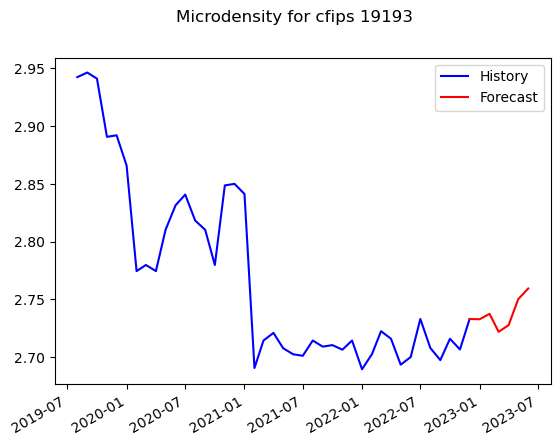

# Micro-business Density Forecasting

The goal of this project is to predict monthly microbusiness density in a given area. The model trained on U.S. county-level data. This will help policymakers gain visibility into micro-businesses, a growing trend of very small entities. This will also will enable new policies and programs to improve the success and impact of these smallest of businesses.

## Package Installation

Package manager used is [conda](https://github.com/conda)
Python Version - 3.10.9


```bash
conda install -c conda-forge scikit-learn
conda install -c conda-forge pandas
conda install -c conda-forge numpy
conda install -c conda-forge statsmodels
conda install -c conda-forge jupyter

```
The project is built using 
## How to use the model for Forecasting 
- Run the Jupyter Notebook 
- In the section 5.0 labelled 'Forecasting, input the cfips value
- Run the cell below to generate the forecast values
- The last cell plots the forecast along with the known values

## Results
The model produces reliable forecasts for given cfips ID. A sample result is displayed below.


## Data Files

labelled_data.csv and additional_data.csv contains the data about various chips and its micro-business density. unlabelled_data.csv contains few of the data that needs to be forecasted. 
Detailed feature description is given below.

- row_id - An ID code for the row.
- cfips - A unique identifier for each county using the Federal Information Processing System. The first two digits correspond to the state FIPS code, while the following 3 represent the county.
- county_name - The written name of the county.
- state_name - The name of the state.
- first_day_of_month - The date of the first day of the month.
- micro-business_density - Micro-businesses per 100 people over the age of 18 in the given county. This is the target variable. The population figures used to calculate the density are on a two-year lag due to the pace of update provided by the U.S. Census Bureau, which provides the underlying population data annually. 2021 density figures are calculated using 2019 population figures, etc.
- active - The raw count of micro-businesses in the county. Not provided for the test set.

census_data.csv contains data from the Census Bureau's American Community Survey (ACS) at data.census.gov. The percentage fields were derived from the raw counts provided by the ACS. All fields have a two year lag to match what information was avaiable at the time a given microbusiness data update was published.
Detailed feature description is given below.
- pct_bb_[year] - The percentage of households in the county with access to broadband of any type. Derived from ACS table B28002: PRESENCE AND TYPES OF INTERNET SUBSCRIPTIONS IN HOUSEHOLD.
cfips - The CFIPS code.
- pct_college_[year] - The percent of the population in the county over age 25 with a 4-year college degree. Derived from ACS table S1501: EDUCATIONAL ATTAINMENT.
- pct_foreign_born_[year] - The percent of the population in the county born outside of the United States. Derived from ACS table DP02: SELECTED SOCIAL CHARACTERISTICS IN THE UNITED STATES.
- pct_it_workers_[year] - The percent of the workforce in the county employed in information related industries. Derived from ACS table S2405: INDUSTRY BY OCCUPATION FOR THE CIVILIAN EMPLOYED POPULATION 16 YEARS AND OVER.
- median_hh_inc_[year] - The median household income in the county. Derived from ACS table S1901: INCOME IN THE PAST 12 MONTHS (IN 2021 INFLATION-ADJUSTED DOLLARS).

## Contributing

Contributions from the open-source community to help improve and refine our forecasting tool are greatly appreciated. Interested contributors can submit pull requests.
For major changes, please open an issue first to discuss what you would like to change.


## License

[GPL-3.0](https://choosealicense.com/licenses/gpl-3.0/)
